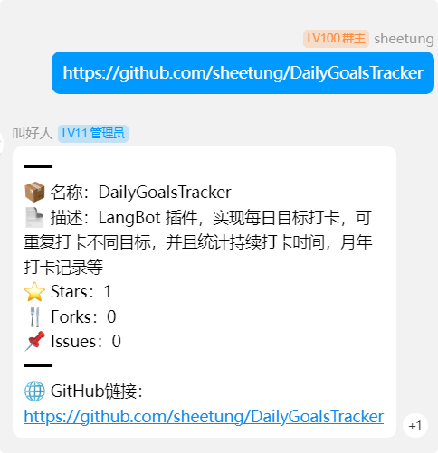
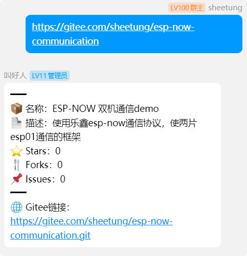

# GitAnalysis

<p align="center">   </p><p align="center"> <b>LangBot 插件，解析 Git 仓库信息，包括 Stars、Forks 等。</b> </p><p align="center">   </p>

------

## 📚 插件简介

`GitAnalysis` 是一个为 [LangBot](https://github.com/RockChinQ/QChatGPT) 设计的插件，能够自动解析 GitHub 和 Gitee 仓库链接，并提取关键信息（如 Stars、Forks、仓库描述等）。它可以帮助用户快速了解目标仓库的基本情况，无需手动访问网页查看。

加群push群主更新，反馈bug,交流

[](https://qm.qq.com/cgi-bin/qm/qr?k=en97YqjfYaLpebd9Nn8gbSvxVrGdIXy2&jump_from=webapi&authKey=41BmkEjbGeJ81jJNdv7Bf5EDlmW8EHZeH7/nktkXYdLGpZ3ISOS7Ur4MKWXC7xIx)

------

## 🛠️ 安装方法

在配置完成 [LangBot](https://github.com/RockChinQ/QChatGPT) 主程序后，使用管理员账号向机器人发送以下命令即可安装：

bash复制

```bash
!plugin get https://github.com/sheetung/GitAnalysis
```

或者查看详细的 [插件安装说明](https://qchatgpt.rockchin.top/develop/plugin-intro.html#插件用法)。

------

## 🚀 使用方法

在对话中发送 GitHub 或 Gitee 的仓库链接，机器人会自动解析链接并发送以下信息：

- 仓库名称
- Stars 数量
- Forks 数量
- 仓库描述
- 其他相关信息（如仓库图标等）

例如：

```plaintext
输入：https://github.com/RockChinQ/QChatGPT  
输出：  
仓库名称：LangBot  
Stars：100  
Forks：50  
描述：大模型原生即时通信机器人平台，支持多平台和多种 LLM。
仓库链接：https://github.com/RockChinQ/QChatGPT
```

------

## 📝 待办事项（TODO）

- [ ] 完成 UI 优化，提升用户交互体验。

------

## 📋 更新历史

- **v0.23**：增加对 Gitee 的支持。
- **v0.18**：完善初始功能，支持 GitHub 仓库解析。

------

## 📝 关于

`GitAnalysis` 是一个基于 [LangBot](https://github.com/RockChinQ/QChatGPT) 的插件，旨在帮助用户快速获取 Git 仓库的关键信息。更多详情请参考 [LangBot 文档](https://qchatgpt.rockchin.top/)。

<p align="center"> <a href="https://github.com/your-repo-url/GitAnalysis/issues">报告问题</a> | <a href="https://github.com/your-repo-url/GitAnalysis/pulls">贡献代码</a> </p>

------

### 🌟 如果你喜欢这个项目，请给它一个星标！🌟